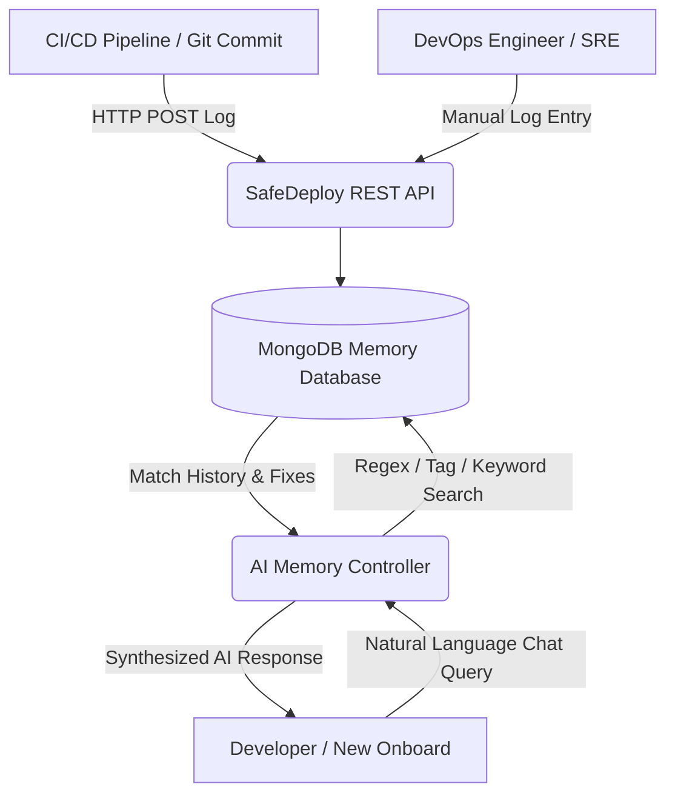

# Solution Overview

SafeDeploy is an intelligent operations dashboard and natural language knowledge retrieval system. It sits adjacent to your CI/CD pipelines to record every deployment event, and acts as a queryable memory database.

## System Architecture

The following diagram illustrates how SafeDeploy ingests data and enables natural language querying:

## Core Modules of the Solution

1. **Deployment Event Collector**: 
   An Express REST API endpoint that accepts metadata payloads (version, service, status, logs, errors, and custom notes) from CI/CD pipelines or automated shell triggers.

2. **Knowledge Registry (Projects & Modules)**:
   A clean dashboard interface to track projects and individual microservice modules (e.g., payment-service, catalog-ui, auth-api) and their current deployment versions.

3. **Natural Language AI Chat Interface**:
   A chatbot interface that translates developers' normal queries (e.g., *"Show me fixes for Redis timeout"*) into indexed DB searches. The engine retrieves matching failure/resolution history and synthesizes a solution response.

4. **SaaS Dashboard (Metrics & Activities)**:
   A modern dashboard summarizing overall health, project metrics, deployment stats, and recent activities.
